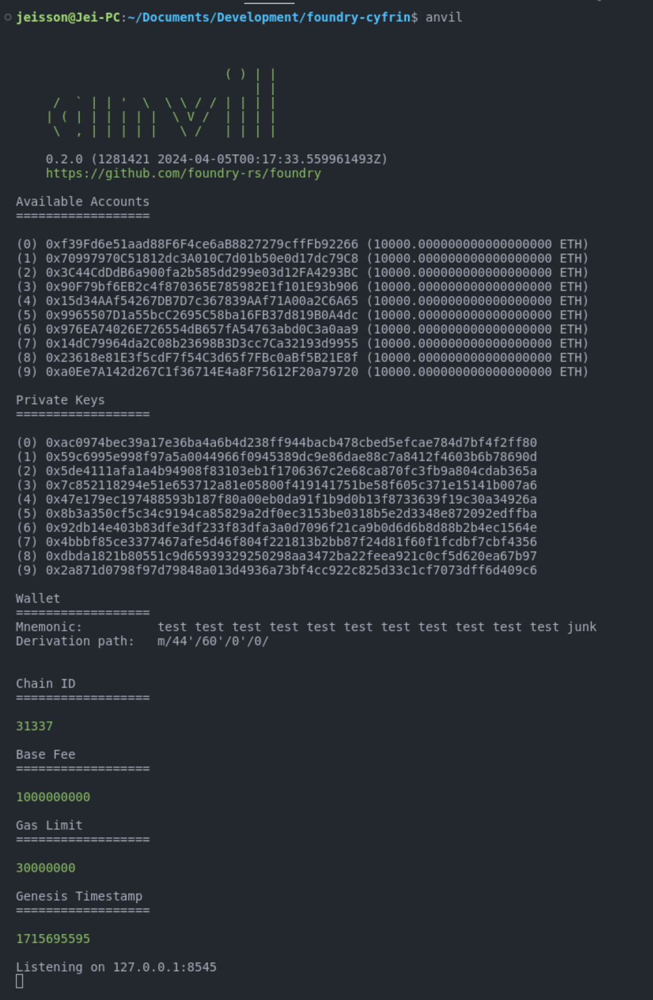
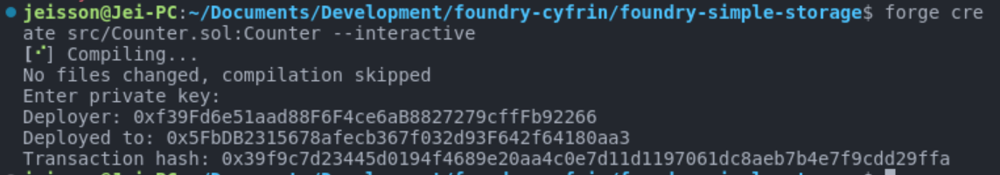
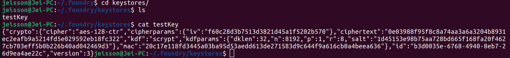
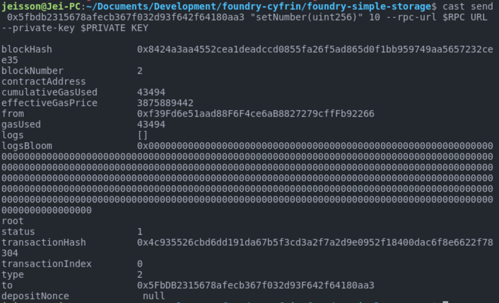

# Foundry y Andvil: Entorno virtual incorporado

Foundry y Anvil: Incorporado Entorno virtual Foundry viene integrado con un entorno virtual en su shell, similar a Remix, el entorno de desarrollo integrado (IDE) más conocido por el desarrollo y la implementación de contratos inteligentes. Dentro del entorno virtual de Foundry, usamos `Anvil` para crear cuentas falsas disponibles, totalmente equipadas con claves privadas falsas, un mnemónico de billetera, detalles de blockchain y una URL de RPC, de la que hablaremos más adelante. A continuación, se explica cómo iniciar la cadena de bloques de Anvil:

``` 
anvil 
```




# Desplegar un contrato inteligente de manera *local - anvil*


## Consola 

Necesitamos tener en una consola ejecutando `anvil`. Luego lanzamos el comando `forge create`


```
forge create src/Counter.sol:Counter --interactive
```

El resultado es:


En este caso luego del atributo `create` sigue la ruta del contrato que será desplegado. El comando `--interactive` nos facilita suministrar la llave privada quien firmará la transacción de despliegue.

El comando `create` tiene más opciones que pueden ser usadas. 
Para profundizar lo puede hacer en:


[Documentación create](https://book.getfoundry.sh/reference/forge/forge-create?highlight=create#forge-create)


## Script

Foundry facilita todo el proceso, ya que está escrito en Solidity. Esto significa que nuestros scripts de implementación también estarán en Solidity. Es esencial distinguir Solidity como lenguaje de contrato de Solidity como lenguaje de scripting. Foundry también incorpora elementos que mejoran nuestra experiencia de Solidity más allá del ámbito de los contratos inteligentes. Por lo tanto, comencemos a crear un script para implementar nuestro contrato de almacenamiento simple.

Recuerde que incluso si es un script, todavía funciona como un contrato inteligente, pero nunca se implementado, por lo que, al igual que cualquier otro contrato inteligente escrito en Solidity, debe especificarse.pragma version

Al igual que podemos importar `Forge Std` para obtener utilidades de prueba al escribir pruebas, `Forge Std` también proporciona algunas utilidades de scripting que importamos aquí.

Puede ir y ver el codigo comentado que se tiene de ejemplo en la carpeta script 

Para ejecutar nuestro script de prueba usaremos:



Para simular la transaccion completa en `anvil` lo hacemos de la siguiente manera:

```
forge script script/Counter.s.sol --rpc-url http://127.0.0.1:8545 --broadcast --private-key "su-llave-privada"
```

Recuerde que usamos estas llaves privadas de esta manera, no lo haga en un entorno
productivo. Ahora, para facilitar un poco el manejo de las variables, lo que se 
puede hacer es usar variables de entornos. Cree un archivo `.env` y leea desde ahí
las variables que necesite. 

Despues de tener sus variables de entorno declaradas en el archivo, para poder leerlas se hace con `soruce .env`

De esta manera podemos ejecutar nuestro comando de la siguiente manera:

```
forge script script/Counter.s.sol --rpc-url $RPC_URL --broadcast --private-key $PRIVATE_KEY
```

Ahora existe una opción aun mas sergura, y es usar el ERC-2335 que se usa para 
encriptar nuestras llaves privadas con una contraseña. Cuando vamos a necesaitar nuestra llave privada nos pedira la contraseña.

`cast wallet import testKey --interactive`

nos pedira ingresar nuestra llave privada a encriptar (una sola vez) y luego
una contraseña con la que se va encriptar. 

con el comando `cast wallet list` podemos tener el listado de las llaves privadas
que se estan almacenando.

para saber mas detalles de como se esta almacenando esta llave privada se debe ir al direcctorio `.foundry/keystores/` que se encuentra en la carpeta raiz. Ahi podemos listar el contenido con `ls`. Para ver el detalle de lo que se squiera se hace con `cat nombre_clave"`



Para usar estas llaves se debe hacer con el atributo `--account` y se le pasa el nombre de la llave privada, luego con el comando `--sender` se le debe pasar la dirección pública de la llave privada a usar. 

```
forge script script/Counter.s.sol --rpc-url $RPC_URL --broadcast --account testKey --sender 0xf39fd6e51aad88f6f4ce6ab8827279cfffb92266
```

## Interactuar con un smart contract

Teniendo nuestro contrato desplegado, necsitamos la direccion publica que tomo el contrato. En este caso la podemos ver al finalizar el proceso de despliegue usando `anvil` en la consola donde se ejecuto el comando o en la consola donde esta corriendo `anvil`

En Foundry tenemos una funcionalidad como lo hemos visto con la encriptación de nuestras llaves privadas que se llama `cast`. Este nos da mas opciones y una de ellas es la de poder enviar transacciones usando el comando `send`.

[Documentación de cast](https://book.getfoundry.sh/reference/cli/cast/send)

En este caso los argumentos necesarios son: 
    * [TO] el destinatario de la transacción
    * [SIG] quien firma la transacción
    * [ARGS]... los argumentos de la función que se esta invocando. 

En este caso vamos a usar la función `setNumber` para darle valor a la variable `number`

```
cast send 0x5fbdb2315678afecb367f032d93f642f64180aa3 "setNumber(uint256)" 10 --rpc-url $RPC_URL 
--private-key $PRIVATE_KEY
```





Ahora, para leer un dato del contrato sin midificarlo se hace con `call`

`cast call 0x5fbdb2315678afecb367f032d93f642f64180aa3 "number()"`

lo que genera es un valor hexadecimal que se debe convertir en el tipo adecuado, en este caso un enter.

`
cast --to-base 0x000000000000000000000000000000000000000000000000000000000000000a dec
`

## Implementación de nuestro contrato en la red de prueba o en la red en vivo con Foundry y Alchemy

¿Tienes curiosidad por saber cómo se vería tu contrato en una red de prueba o en una red en vivo? Si es así, ¡abróchate el cinturón porque esta publicación de blog cubrirá exactamente eso! Le guiaremos a través del proceso de actualización de nuestro archivo de variables de entorno (.env) para una red de prueba real.
Claramente, necesitamos una red de prueba real para una red real. Pero nuestra fiel Metamask tiene conexiones Infura incorporadas que son incompatibles. ¿Por qué? Porque están diseñados específicamente para MetaMask. Por lo tanto, necesitamos nuestra propia dirección URL de llamada a procedimiento remoto (RPC).

## Creación de nuestra propia URL RPC para una red de prueba

Para crear uno, podríamos ejecutar nuestro propio nodo de blockchain, pero seamos honestos: muchas personas prefieren evitar esa ruta. En su lugar, utilizamos aplicaciones de Node as a Service (NaaS) para acelerar el proceso.
Una opción prometedora es usar Alchemy, una plataforma NaaS gratuita a la que podemos enviar las transacciones. Este procedimiento se encuentra dentro de la sección Implementación en Testnet o Mainnnet en el repositorio del curso completo de Foundry.

Para acceder a la plataforma Alchemy, simplemente hacemos clic en la función antes mencionada. En la plataforma, nos registramos (utilicé el inicio de sesión de Google para esta demostración).
Nuestro siguiente paso es crear una nueva aplicación en la interfaz de usuario de Alchemy. Llamé a la mía Sepolia Testing y mantuve la misma descripción, dado que nuestra cadena será una de Ethereum basada en Etiopía.
Podemos omitir las funciones avanzadas por ahora y finalizar nuestra aplicación. Ahora tenemos los detalles de la aplicación necesarios para nuestro nodo, incluida la frecuencia de las llamadas y otros detalles. También tenemos un nuevo punto final https haciendo clic en la tecla de vista, que funciona exactamente de la misma manera que nuestro punto final ganache o MetaMask.

## Ejecución de la transacción
Con nuestra URL RPC de Sepolia y la clave privada de MetaMask, ejecutar una transacción ahora se vuelve tremendamente más fácil.

Este comando despliega nuestro contrato en la red de prueba y podemos monitorear la transacción en nuestro panel de control de Alchemy.
Pronto descubrimos que nuestro contrato, Simple Storage, se ha implementado en la cadena Sepolia. Podemos tomar el hash de nuestra transacción e ingresarlo en Sepolia etherscan IO para confirmar la transacción exitosa.
Después de actualizar nuestro panel de control de Alchemy, verificaremos las solicitudes enviadas y rastrearemos la transacción sin procesar de envío de ETH que transmitió nuestra transacción a la cadena de bloques.
Entonces, ¡así es como implementamos nuestro contrato en una red de prueba real aprovechando Foundry y Alchemy!

`
source .env
forge script script deploySimpleStorage.s.sol --rpc_url=$Sepolia_RPC_URL --private-key=$private_key --broadcast 
`


## Test

Para ejecutar TODOS nuestros test:

`forge test`

Para ejecutar un test en especifico:

`forge test --mt <nombre_del_test>`

Si queremos ver mas detalle de lo que ocurre en los test:

`forge test -vvv`

Para probar haciendo un fork 

`forge test --fork-url <ruta_RPC_proveedor>`

Saber el costo de gas de un test 

`forge snapshot --mt <nombre_del_test>`

crea un archivo en la raiz, llamado `.gas-snapshot`